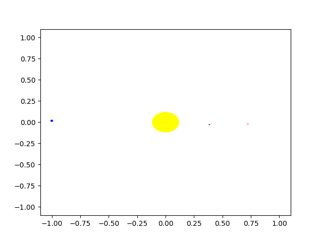

# orbits

El código para reproducir los resultados del artículo "Rediscovering orbital mechanics with machine learning".

    -La carpeta "simulate" contiene las clases base, así como el código para generar órbitas simuladas y para leer los datos de NASA.
    -La carpeta "planets_data" contiene los datos descargados del sistema Ephymeris de NASA, y procesados en el formato especificado en el artículo.
    -El archivo "ml_model.py" contiene el modelo de red neuronal gráfica.
    -El archivo "planets_tf2.py" ejecuta la red neuronal gráfica.
    -El archivo "symbolic_regression.py" ejecuta el algoritmo de regresión simbólica.
    -Todos los scripts de trazado utilizados en el artículo están contenidos en la carpeta "plotting".

Para ejecutar el código,

    -crea un entorno conda y ejecuta pip install en el archivo "requirements_pip.txt".
    -Crea el archivo "solar_system_data.pkl" ejecutando 'read_orbits.py', que espera todos los datos de Horizon bajo "planets_data/barycenter".
    -Asegúrate de que el "solar_system_data.pkl" esté ubicado bajo "planet_data/".
    -Ejecuta el cuaderno paso a paso en "planets_tf2.ipynb"
        Nota: puedes saltarte el paso de parámetros hiperpárametros de Optuna y entrenamiento y cargar el archivo del modelo preentrenado "/saved_models/mejor_modelo_orbits.keras" definiendo el parámetro en el paso de carga del punto de control del modelo. (load_checkpoint)

